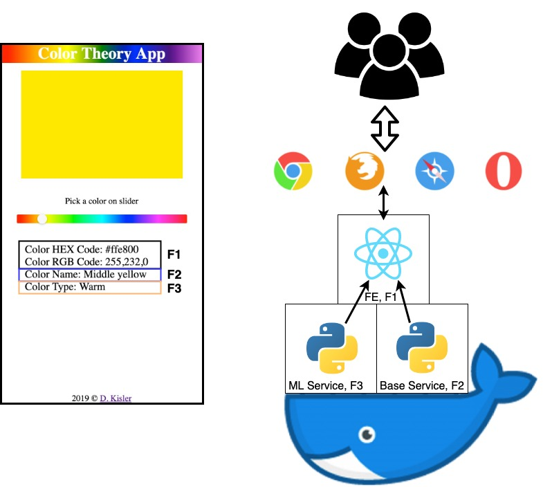

# Color Theory <a href="https://color-theory-app.dkisler.com" target="_blank">App</a>

## Description

A toy project/demo on how to structure and develop micro-service driven application powered by machine learning service.

### Motivation

Since 2019-04 till 2019-06, only <em>5 out of over 630 articles</em> about ML services deployment were published on <a href="https://towardsdatascience.com" target="_blank">towardsdatascience.com</a>. This figures reflects the situation in the data science community; only a small fraction of engineers/data scientist are capable to deliver ML product into production.

## App Idea

Built a web app to answer the question "What's the color?" Assuming that it's a point in RGB, or HEX space with a name and type.

### App Classical Service Features

Display the color name, RGB and HEX codes on the user input.

### ML Service Feature

The app objective is to define **binary category** of a color selected by user. Two possible categories being *warm* and *cool* are <a href="https://en.wikipedia.org/wiki/Color_theory#Warm_vs._cool_colors" target="_blank">described</a> as following:

> Color theory has described perceptual and psychological effects to this contrast. Warm colors are said to advance or appear more active in a painting, while cool colors tend to recede; used in interior design or fashion, warm colors are said to arouse or stimulate the viewer, while cool colors calm and relax.

## App Structure

```
color_theory_app
    ├── backend
    ├── frontend
    └── docker-compose.yaml
```

The app has two service sides, frontend and backend:

- *frontend/client side* can be generalised as the product with developers + DevOps maintaining and developing it
- *backend/server side* can be generalised as the micro-service with data scientist/engineers + machine learning engineers + developers + Dev-/DataOps maintaining and developing it

Frontend/product communicates to the backend (e.g. machine-learning service) to provide users unique feature, or improve users experience.

### Backend

Backend has the interface(s) to communicate with other services (fronted service in our case) with a set of end-points.

```
backend
    ├── libs
    ├── service_base
    └── service_ml
```

The app's server side has two micro-services with HTTP interfaces (API end-points):

- service_base - provides color name
- service_ml - provides color binary class/type

Both services API's have similar code structure:

```
service
  └── api
       ├── app
       │    ├── sub-mobules/data
       │    ├── __init__.py   
       │    ├── ...
       │    └── endpoints.py       
       ├── requirements.txt
       └── run_server.py
```

With service runner/executable, `` run_server.py ``.

#### Base Service

The service requires an input color as the HEX, or RGB code and returns the color name. The color name of a given color is identified as the reference color name based on the Euclidian distance between an input color and the reference <em>in-memory</em> colors data set:

1. Array of euclidian distances between input color and reference colors is calculated in RGB space
2. Minimum value of the distance is identified
3. The Reference color name which corresponds to the found reference color is assigned to the input color:


The service delivers the product feature <em>F2</em> (see [infrastructure](#infra)).

#### ML Service

```
service_ml
  ├── Dockerfile
  ├── api
  └── ml
      ├── model
      └── ...
```

The machine learning service consumes the <em>model</em> from `./service_ml/ml/model/` and predicts a color class/type based on the input color code:

```python
model.predict(pandas.DataFrame({'r': [r_in],
                                'g': [g_in],
                                'b': [b_in]}))
```

The service delivers the product feature <em>F3</em> (see [infrastructure](#infra)).

#### Machine Learning Model Development

```
ml
├── data
│   └── warm_cold_colors.csv
├── model
│   └── model_v1.xgb
└── model.ipynb
```

The models can be *iteratively* developed by the data science team according to the flow:

```
consume data from data dir -> train and evaluate the model -> model export into model dir -> model quality monitoring -> model re-train
```

#### API: Endpoints Contract

<table style="width:100%">
  <tr>
    <th>Back-end Service</th>
    <th>Endpoint</th>
    <th>Response: 200</th>
    <th>Response: 500</th>
  </tr>
  <tr>
    <td>
    Base service
    </td>
    <td>
    <pre>
     /name/hex?hexcode=5C77FA
    </pre>
    <pre>
     /name/rgb?r=92&g=119&b=250
    </pre>
    </td>
    <td>
    <pre>
    {
      "data": {
          "color": {
               "r": 92,
               "g": 119,
               "b": 250
           },
      "name": "Blueberry"
     }
    }
    </pre>
    </td>
    <td rowspan="2">
    <pre>
    { "data": null }
    </pre>
    </td>
  </tr>
  <tr>
    <td>
    ML service
    </td>
    <td>
    <pre>
     /type/hex?hexcode=5C77FA
    </pre>
    <pre>
     /type/rgb?r=92&g=119&b=250
    </pre>
    </td>
    <td>
    <pre>
    {
      "data": {
          "color": {
               "r": 92,
               "g": 119,
               "b": 250
          },
          "is_warm": 1
     }
    }
    </pre>
    </td>
  </tr>
</table>

### Frontend/Client Side

Frontend service of the app gives web interface for a user to select a color of interest and define its properties by communicating with the backend via its API end-point(s). It also delivers feature <em>F1</em> (see [infrastructure](#infra)).

## <a name="infra"></a>App UI + Infrastructure



## App Run

### Requirements

```bash
docker ver. >= 18.09.2
docker-compose ver. >= 1.23.2
```

#### Installation

Docker:
- <a href="https://docs.docker.com/install/linux/docker-ce/ubuntu/" target="_blank">Ubuntu</a>
- <a href="https://docs.docker.com/docker-for-mac/install/" target="_blank">MacOs</a>
- <a href="https://docs.docker.com/docker-for-windows/install/" target="_blank">Windows</a>

### App Launch

Docker-compose:
- <a href="https://docs.docker.com/compose/install/" target="_blank">Cross-platform</a>

To launch the app, clone the repo

```bash
git clone git@github.com:kislerdm/color_theory_app.git && cd color_theory_app
```

and build&run docker images with services and the client app

```bash
docker-compose up -d
```

Upon docker images build completion and when docker containers are up and running, you can access UI by going to http://localhost:10001 (features <em>F1+F2+F3</em>), or http://localhost:10000 (features <em>F1+F2</em>) in your browser.
